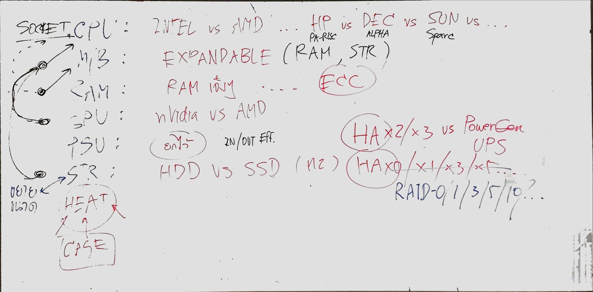
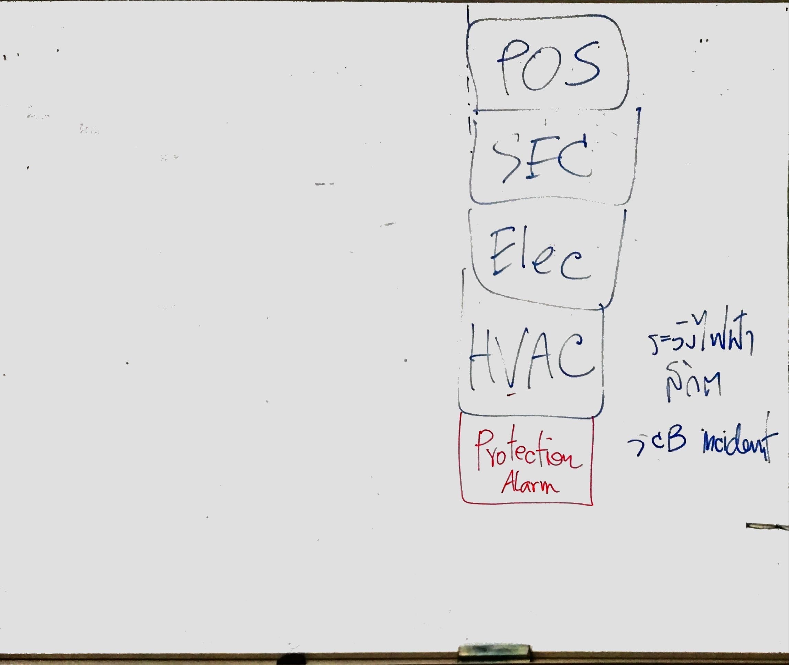

# Computer Hardware
- ว่าด้วยรักษ์โลก ทำได้อย่างไรบ้าง
	- Power Efficiency => ทำงานได้ดี ใช้พลังงานน้อยกว่า
	- reuse แร่ธาตุ
	- Logistic and ___
	- (ไม่เชิงรักษ์โลก แต่ไปเน้นที่การอยู่ร่วมกันกับมนุษย์คนอื่น ๆ ) conflict-free => ไม่ใช้แร่จากแหล่งที่มาไม่ชัดเจน ex ไม่ใช้เพชรจากเหมืองในพื้นที่ซึ่งมีการเข้าปะทะกันอยู่หรือเหมืองที่ส่งเสริมการก่อสงคราม
- System admin ต้องรู้ข้อจำกัด + สเปก hardware ที่ใช้ (เริ่มจากการลองดูสเปกคอมตัวเองก็ได้)
	- 
	- มองในฐานะคนซื้อคอมประกอบก็ได้ => เริ่มต้นจากคำถามว่า ==งบเท่าไร + ใช้ทำอะไร==
	- ในงบที่กำหนดมา ==ครอบคลุมอะไรบ้าง== ex เฉพาะอุปกรณ์ในเคสอย่างเดียว, รวมจอรวมอุปกรณ์ต่อพ่วงด้วย
	- **!!สำคัญ!!** ในเวลาต่อมา ==ถ้าจะอัพเกรด/maintain ทำได้ไหม + ง่ายแค่ไหน + ด้วยอุปกรณ์อะไร==
	- ประกอบคอมเริ่มต้นจาก
		1. CPU => ใช้ค่ายไหน (เป็นตัวกำหนด mainboard)
		2. Mainboard => เลือกตามฟีเจอร์ที่ต้องการเช่นอุปกรณ์ต่อพ่วง, RAM Slot, สาย communication ต่าง ๆ เป็นต้น ==มีผลต่อการอัพเกรดอุปกรณ์อย่างมาก เลือกเผื่ออนาคตไว้ด้วยเสมอ==
		3. RAM => ถ้าเป็นระดับ server ต้องมี ==Error Correction Code (ECC RAM)== ในระดับ hardware ด้วย
		4. GPU => อาจมีหรือไม่มีก็ได้ ขึ้นกับ use case (ถ้ามี on-board GPU แล้ว อาจไม่ต้องมีก็ได้)
			- ใช้คำนวณบางอย่างได้รวดเร็วกว่า CPU เช่น matrix, polygon, ภาพ 3D, ภาพเคลื่อนไหว
			- คำนวณได้ไวกว่าเพราะมีจำนวน core ที่คำนวณพวกนี้มากกว่า + วงจร dedicate ไปทางนี้
			- ได้ผลพลอยได้เป็นการใช้เพื่อทำ crypto mining และทำ Machine learning
			- ที่ใช้ GPU ทำ ML ได้ดีเพราะ ML ส่วนใหญ่เป็นการคำนวณ matrix
		5. PSU (Power Supply Unit) => เลือกให้เพียงพอกับความต้องการ มากเกิน=เปลือง น้อยไป=รันไม่ได้
			- แปลงไฟจาก AC เป็น DC
			- ควรจ่ายไฟได้สม่ำเสมอ ไม่ติด ๆ ดับ ๆ เมื่อไฟตก/ฟ้าผ่า/ไฟกระชาก
			- การจ่ายไฟต้องคำนึง 2 อย่าง
				- ไฟพอ => มี voltage + ampere เพียงพอต่อการใช้งาน
				- ไฟมีคุณภาพ => จ่ายไฟเสถียร, voltage สม่ำเสมอ
		6. Storage => Harddisk หรือ SSD
	- สำหรับ server ก็ใช้หลักการเดียวกัน ต่างกันที่ตัวอุปกรณ์จะใช้ตัวที่จำเพาะกับ server ไม่ใช่กับ PC (โดยเฉพาะ server เก่า ๆ จะใช้อุปกรณ์ของ PC ไม่ได้)
		- เมื่อก่อนต้องการอุปกรณ์ของค่ายตัวเองเท่านั้น ซึ่งเมื่อบริษัทเจ๊งหรือเลิกขายอุปกรณ์อะไรไปแล้ว ทำให้ต้องรื้อใหม่ทั้งหมด (ส่วนใหญ่จะจำกัดกันที่ mainboard)
# Environment for maintaining server
- สภาพในการรัน server ควรมีฝุ่นน้อยและเย็น
	- ฝุ่นทำให้ระบายความร้อนไม่ดี
	- ร้อนเกินไปทำให้อุปกรณ์ Overheat
		- heat sink, water cooling, พัดลม
		- การระบายความร้อนด้วยอากาศ เน้นให้เกิดการ flow ของอากาศเข้าแล้วออกเพื่อให้อากาศร้อนออกมา และอากาศเย็นเข้าไปแทน
		- การคุมความร้อนที่ดีคือเป็นสภาพปิด ที่เราคุมทางเข้า-ออกอากาศได้
- 
- Position
	- พลังงาน => เสถียรและเพียงพอต่อการใช้งาน
	- ภัยพิบัติ => เลือกที่ตั้งซึ่งมีภัยพิบัติต่าง ๆ ได้น้อยเช่นแผ่นดินไหว น้ำท่วม (หากเลี่ยงไม่ได้ ให้หาวิธีป้องกันหรือลดความเสียหาย) หรือแดดไม่ส่อง ฝนไม่สาด ควบคุมคนเข้า-ออกได้ (หรือแม้แต่ก่อจลาจลได้ยาก บางที่ไม่บอกว่าเป็นศูนย์คอมเพื่อลดปัญหาจากการก่อจลาจล ขโมย ก่อการร้าย)
- Physical security
	- intrusion/thievery => กล้องวงจรปิด ลูกกรง ประตู จ้างยาม (ดูความคุ้มด้วย)
- Electricity
	- Uninterruptable Power Supply (UPS) => สำรองไฟเผื่อกรณีไฟดับสั้น ๆ 
	- Power Generator => ปั่นไฟเองกรณีไฟดับยาว
- Heating, Ventilation, and Air Conditioning (HVAC)
	- ปรับอุณหภูมิให้เหมาะสม ไม่ร้อนไป ไม่หนาวไป เพราะมีผลกับการทำงานของอิเล็กทรอนิกส์
	- ความชื้น(สัมพัทธ์) => แห้งไปเกิดไฟฟ้าสถิตย์ได้ ทำให้อุปกรณ์เสียหาย
	- กรองฝุ่น
	- หลาย ๆ ทีเป็นตัวเลือกที่ไม่ดีเท่าไรเพราะเปลืองไฟ => ทำ rack ให้เย็นก็พอ (https://www.techtarget.com/searchdatacenter/tip/Data-center-cooling-systems-and-technologies-and-how-they-work)
- Protection Alarm
	- เมื่อเกิด incident/disaster ขึ้นต้องได้รับการแจ้งเตือนเช่น อุณหภูมิมากไป ความชื้นมากไป น้ำท่วมเกินระดับที่กำหนด ตรวจจับควัน/ไฟไหม้ ระบบดับเพลิง
	- ระบบจับควันมีปัญหากับการเผาไหม้สารพวก ethanol เพราะติดไฟแล้วมองไม่เห็น+ไม่มีควัน จึงต้องใช้คู่กับ thermal + heat detector
	- เมื่อระบบดีแล้ว ก็ยังต้องมีการ take action ของบุคคลเพิ่มเติมเองด้วย เช่น ใช้ถังดับเพลิงให้เป็น
	- SCB data center incident
		- https://www.posttoday.com/social/local/421298
		- ช่างเข้าซ่อมบำรุงแล้วเกิดฝุ่นไปติดเข้ากับ smoke detector แล้วระบบอัตโนมัติปล่อยก๊าซไล่ออกซิเจน ทำให้คนที่อยู่ในห้องเสียชีวิต (แม้จะมีปุ่มให้กดยกเลิกแล้วก็ตาม แต่ก็ไม่ทันเวลา)
---
# Keywords & Questions
- ทำไมต้องใช้ GPU ในการขุด crypto
	- https://www.g2.com/articles/gpu-mining
	- https://www.quora.com/Why-were-graphics-cards-so-important-in-Bitcoin-mining
- AC vs DC
- Harddisk vs SSD มีข้อดีข้อเสียอย่างไร ทำไมบางงานควรใช้ Harddisk มากกว่า